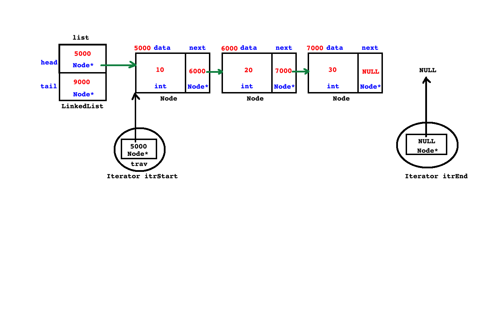
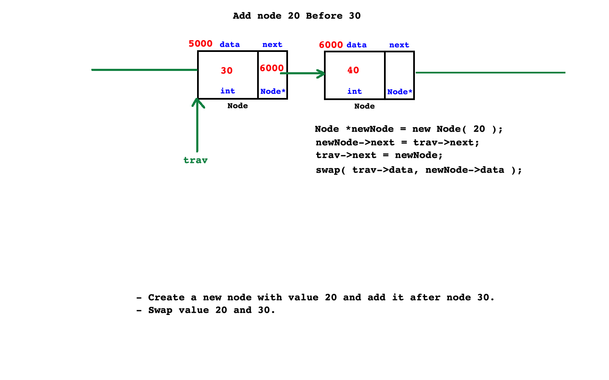

# ADS syllabus
* C++ 03 Standard
### Data Structure
* It is branch of computer science which is  used to organize data efficiently in RAM.
* Types of data structure
    1. Linear/Sequential Data Structure
        - Array
            * Single dimensional Array
            * Multidimensional Array
        - Stack
        - Queue
            * Linear Queue
            * Circular Queue
            * Priority Queue
            * Deque
        - LinkedList
            * Singly Linked List
                - Linear Singly Linked List
                - Circular Singly Linked List 
            * Doubly Linked List
                - Linear Doubly Linked List
                - Circular Doubly Linked List
    2. Non Linear Data Structure
        - Hashtable
        - Tree
        - Graph
### Algorithm
* It is branch of computer science which is used to process data strored in data structure.
* Classification
    - Searching Algorithm
        1. Linear Search
        2. Binary Search
        3. Hashing
    - Sorting Algorithm
        1. Bubble Sort
        2. Selection Sort
        3. Insertion Sort
        4. Merge Sort
        5. Quick Sort
        6. Shell Sort
        7. Radix Sort
        8. Heap Sort


# day1


## to do 
1. menu driven program for vector function 

## notes

1. Arrays
 + array is a linear data structue, or collection
 + in which we can store element of same type in continous memory location
     +  where value or data stored in data structure is called element   
 + if we want to access elements from array, then we should use integer index
 + Array index always begins with 0. 
* 2. Array BOunds 
 + min index and max index 
 + Min index : 0
 + Max index : SIZE - 1
* in C/C++ , checkign array bounds checking is job of a programmer
* types of Array": 
 1. Single Dimensional Array
 2. Multi Dimensional Array

* Advantages of array: 
 1. random access
 + if we know index of element, then we can access it, very fast

* Limitation of Array: 
 1. we cannot resize array.
 2. it requires continuous memory . 
 3. Compiler do not check array bounds 
 4. element isnertioon and deletion takes more time in a array
 5. using assignment operator, we cannot copy one array into another arra
 +  need memcpy() in c++ or loop to copy one array to another    
 + to overcome, Array, we can use Linked list 

2. Vector

### 3. Linked List : data structure
 + linked list is a linear data strucure,which is collection of elements
   + where each element is called a node
* 1. Node 
  + here node, is a element, which can have 
    + object of node class has 2 part or 3 part,where
    + 2 parts are int data and node* next
    + 3 parts are node* prev, int data ,node* next  
  + where , 
    + data --> data stored for number is of type integer
    + next,prev, --->  contain address of next node object, so type of node is node*   
  + node is a object which may contain either 2 parts /3 parts depending on type of linked list
```c++

Class Node 
{
Node* prev ;
int data; 
Node* next;

}

// OR
Class Node 
{
int data; 
Node* next;

}

```
* 2. Types of linked list
 1. Singly LinkedList(SLL)
  + in a linked  list, if node(element) contains two part
   1. a element(data) 
   2. a pointer which is address of next node object 
   + is callled singly LL 
 2. Doubly Linked List(DLL)
 + in a linked listm if node contains three parts
  1. a pointer which contains address of previous node object(prev)
  2. a element(data)
  3. a pointer which contains address of next node object(next)
  + is called doubly linked list
* 3. Node Object
  1. Head
   + In a LL, head is a pointer, which is designed to store address of first node object
   + if value of head is null, then LL is considered as empty
   ```c++
    bool empty(){
       return head == NULL
    }
   ``` 
   2. Tail
   + In a LL, tail is a pointer which is designed to store address of last node object    
* 4. Singly and DOubly LL are further classified into two types: 
  1. Linear LL 
  2. Circular LL 


* 5. Linear Singly Linked List ( L-SLL)
  +  if next pointer of tail node , contains NULL is call singly list
  +  in a SLL, if next pointer of last node object contains NULL value, then such a LL is called L-SLL      


* 6. Circular Singly Linked List(C-SLL)
  +  in a SLL, if next pointer of last node object contains address of first node, then such a LL is called C-SLL


* 7. Liner Doubly Linked List(L-DLL)
  + in a DLL, if prev pointer of first node and next pointer of last node contains NULL values then it is called as L-DLL 

* 8. Circular Doubly Linked List(C-DLL)   
  +  in a DLL, if prev pointer of first node contains address of last  and next pointer of last node contains address of first node then it is called as C-DLL


# day2 

## to do 
1. list in c++ stl 
## classwork notes

1. linked list and node class
```cpp
class LinkedList; 
class Node{

private: 
 int data;
 Node *next; 
public: 
 Node (int data = 0) : data(data), next(NULL)
 {}

 friend class LinkedList; 

};

class LinkedList{

private: 
Node *head;
Node *tail; 


```

### 4. we can perform following Operations on Singly Linked List
* 3 condition to consider 
+ 1. list list is empty i.e no node
+ 2. list has one node 
+ 3. list has more than one node 
1. bool empty()
```cpp
bool empty(void) const throw()
{
    return this->head == NULL;   
}
```
2. void addFirst(int data) throw(bad_alloc)

```cpp
void addFirst(int data) throw(bad_alloc)
{
    // add data to LL , using node, by creating a node object 
    Node *newNode = new Node(data); 
    // NULL in next by default : is value of next 
    // in Linked list, two element : head and tails (with value Null)
    // i.e LINKED LIST EMPTY
    if(this->empty())
    {
         this->tail = newNode; 
        //  this->head = newNode; 
         
    }else
    { 
        newNode->next = this->head; 
       // this->head = newNode; 
    }
     this->head = newNode; 
}
```
3. void addLast(int data) throw(bad_alloc)

```cpp
void addLast(int data) throw(bad_alloc)
{
    // add data to LL , using node, by creating a node object 
    Node *newNode = new Node(data); 
    // NULL in next by default : is value of next 
    // in Linked list, two element : head and tails (with value Null)
    // i.e LINKED LIST EMPTY
    if(this->empty())
        // this->tail = newNode; 
         this->head = newNode;  
    else
     this->tail->next = newNode;
     // use tail pointer to add node at last and upate tail
    
     this->tail = newNode; 
}
```
4. int addAtPosition(int position,int data) throw(bad_alloc, Exception)

```cpp
void addAtPosition(int position,int data) throw(bad_alloc)
{                        
   
  if(position <= 0 )
  {
    throw Exception("Invalid Position"); 
  }else if(position == 1)
  this->addFirst(data); 
  else if(position > this->nodeCount())
  this->addLast(data); 
  else{

      Node *trav = this->head; 

      for(int count = 1; count < position - 1; ++ count)
      { 
          trav = trav->next;         
      }

      Node *newNode = new Node(data); 
      
      newNode->next = trav->next; 
      trav->next = newNode; 

  }                                 
}      
```
5. void removeFirst() throw(Exception)

```cpp
void removeFirst(void)
{
    if(this->empty())
    {
        throw Exception("LinkedList is empty"); 
    }else if(this->head == this->tail)
    { 
        delete this->head; 
        this->head = this->tail = NULL; 
    }else
    {
       // this->head = this->head->next; 
       Node *ptrNode = this->head; 
       this->head = this->head->next; 
       delete ptrNode; 
      // notrequired as pointer has local spoce, no need for null
       ptrNode = NULL;
        
    }
    
```
6. void removeLast() throw(Exception)

```cpp
void removeLast() throw(Exception )
{
 
     if(this->empty())
    {
        throw Exception("LinkedList is empty"); 
    }else if(this->head == this->tail)
    { 
         delete this->head; 
         this->head = this->tail = NULL; 
    }else
    {
       Node *trav = this->head; 

       while(trav->next != this->tail)
       {
           trav = trav->next; 
       }
        delete this->tail; 
        this->tail = trav; 
        this->tail->next = NULL; 
    }
}
```
7. removeFromPosition(int position) throw(Exception)

```cpp
void removeFromPosition(int position) throw(Exception) 
{
    if(position < 0 )
    {
        throw Exception("Invalid address "); 
    }else if(position == 1)
    this->removeFirst();
    else if(position >= this->nodeCount())
    this->removeLast(); 
    else
    {
        Node *trav = this->head; 
        for(int count = 1; count < position - 1;++ count)
        {
              trav = trav->next; 
        }
         Node *ptrNode = trav->next; 

        trav->next = ptrNode->next; 
        delete ptrNode; 
        
    }
    

}
```
8. iterate/print linked list
```cpp
void printList(void){


    if(this->empty())
    throw Exception("LinkedList is empty"); 
    else{

        Node *trav = this->head;

        while(trav != NULL)
        {
            cout <<trav->data <<" "; 
            trav = trav->next; 

        }
        cout<<endl; 
    }
}
```
9. void clear() throw()
```cpp
```
10.  int  nodeCount()
```cpp
int nodeCount() const throw() 
{

   Node *trav = this->head; 
     int count = 0; 
   while(trav != NULL)
   {
      ++count; 
       trav = trav->next; 
   }
 return count; 

}
```
11. ~LinkedList(void)
* use valgrind , to check memory leakage
* as we didnt write destuctor so showing memory leakge 
* after destructor , valgrind shows 
>  All heap blocks were freed -- no leaks are possible
 >valgrind ./filename.out 
 ```cpp
~LinkedList(void)
{
    while(!this->empty())
    {
        this->removeFirst();
    }
}
 ```     


## 5.  list class in stl 
```cpp
#include<iostream>
#include<list>

using namespace std;

int main(void) 
{
    list<int> intList; 

    intList.push_front(10); 
    intList.push_back(20); 
    intList.push_back(30); 
    intList.push_back(40); 
     intList.push_back(50); 
    intList.push_back(60);
intList.pop_back();
    intList.pop_front(); 


    for(int element : intList)
    cout<<element<<"  "; 
    return 0; 
}

```
## 6. iterate list in non member function 
* create iterator class itrStart and itrEnd  

```cpp

```
## Reverse Linked List
* using recursion 
* using 3  pointers

```cpp
 void reverse(void) throw(Exception)
        {
            if(this->empty())
            throw Exception("LinkedList is empty");
           
           Node *trav = this->head; 

           Node* current;
           Node* previous = NULL;  
           while(trav != NULL)
           {  current = trav; 
               trav = trav->next; 
                current->next = previous; 
                 previous = current; 
            
           }

           this->tail = this->head; 
           this->head = previous; 

        }

```

## 7. Add node before address of node given


## 8. Delete,node whose  given address before node


## 9. Limitation of S-LL
1. in a Linear SLL, we cannot re-visit previous node . 
+ so to overcome it, we must store  address of first node inside next pointer of last node 
i.e use C-SLL. 

## 10. Circular Singly LL (C-SLL)
* if next pointer of last node contains address of first node it is called C-SLL. 
* tail pointer always stores address of first node
* head pointer always stores address of last node
* Last Node's next pointer => this->tail->next
* First Node's address => this->head
> this->tail->next = this->head; 


### 11. function in which changes be there, from Linear-LL
1. function addFirst()


```cpp
void addFirst(int data) throw(bad_alloc)
{
    // add data to LL , using node, by creating a node object 
    Node *newNode = new Node(data); 
   
    if(this->empty())
     {
     this->tail = newNode; 
     

        // for liner
        // this->tail = newNode; 
        //  this->head = newNode; 
         
     } else
      { newNode->next = this->head; 
        //for linear
        //newNode->next = this->head; 
       // this->head = newNode; 
      }
       this->head = newNode;      
         this->tail->next = this->head; 
    // for linear
     // this->head = newNode; 
}

```
2. Add Last

```cpp
void addLast(int data) throw(bad_alloc)
{
  
    Node *newNode = new Node(data); 
   
    if(this->empty())
    {
        this->head = newNode; 
       // for linear

        // this->tail = newNode; 
       //  this->head = newNode;  
    }
    else{
        this->tail->next = newNode;      
        // for linear
       //  this->tail->next = newNode;
     // use tail pointer to add node at last and upate tail
    }
    this->tail = newNode; 
       this->tail->next = this->head; 
    // for linear
    // this->tail = newNode; 
}
```

3. Remove First

```cpp
void removeFirst(void) throw(Exception )
{
    if(this->empty())
    {
        throw Exception("LinkedList is empty"); 
    }else if(this->head == this->tail)
    { 
            delete this->head; 
            this->head = this->tail = this->tail->next = NULL; 

       // for linear 
        //delete this->head; 
        //this->head = this->tail = NULL; 
    }else
    {
      Node *ptrNode = this->head; 
      this->head = this->head->next; 
      delete ptrNode;
      this->tail->next = this->head;  
     

// for linear
       // Node *ptrNode = this->head; 
       // this->head = this->head->next; 
       // delete ptrNode; 
      // notrequired as pointer has local spoce, no need for null
      // ptrNode = NULL;
        
    }
    
 
}
```

4. for Remove last
* change in one line 
>  this->tail->next = this->head; 
    
5. count node in link list

```cpp
int nodeCount() const throw() 
{
  int count = 0;
  if(!this->empty())
  {
     Node *trav = this->head; 
     do
     {
         ++ count; 
         trav = trav->next; 
     } while (trav != this->head);
  }
 return count; 
}

```


## 12.  Limitatio of C-Singular-LL
1. in a C-SLL, to visit previous node, we need to traverse complete linked list, which is time consuming 
+ to overcome this limitation, we should use doubly linked list


## 13. Doubly LL
1. in a Node
```cpp
class Node{

private: 
Node *prev; 
 int data;
 Node *next; 
public: 
 Node (int data = 0) : data(data),prev(NULL), next(NULL)
 {}
 friend class LinkedList; 
};

```
 
## 4. we can perform following Operations on Singly Linked List
* 3 condition to consider 
+ 1. list list is empty i.e no node
+ 2. list has one node 
+ 3. list has more than one node 

1. void addFirst(int data) throw(bad_alloc)

```cpp
void addFirst(int data) throw(bad_alloc)
{
   
    Node *newNode = new Node(data); 
  
    if(this->empty())
    { 
        this->tail = newNode;              
    }else
    { 
        newNode->next = this->head; 
        this->head->prev = newNode; 

    }
    this->head = newNode; 
}
```
2. void addLast(int data) throw(bad_alloc)

```cpp
void addLast(int data) throw(bad_alloc)
{
   
    Node *newNode = new Node(data); 
  
    if(this->empty())
       { 
           this->head = newNode;
       }
        
    else
  { 
      this->tail->next = newNode; 
      newNode->prev = this->tail;      
  }
    this->tail = newNode; 
     
}
```
3. int addAtPosition(int position,int data) throw(bad_alloc, Exception)

```cpp
void addAtPosition(int position,int data) throw(bad_alloc)
{                        
   
  if(position <= 0 )
  {
    throw Exception("Invalid Position"); 
  }else if(position == 1)
  this->addFirst(data); 
  else if(position > this->nodeCount())
  this->addLast(data); 
  else{

      Node *trav = this->head; 

      for(int count = 1; count < position - 1; ++ count)
      { 
          trav = trav->next;         
      }

      Node *newNode = new Node(data);
        
      newNode->prev = trav; 
      newNode->next = trav->next; 
      trav->next = newNode;
      trav->next->prev = newNode;  

  }
```
4. void removeFirst() throw(Exception)

```cpp
void removeFirst(void) throw(Exception )
{
    if(this->empty())
    {
        throw Exception("LinkedList is empty"); 
    }else if(this->head == this->tail)
    { 
        delete this->head; 
        this->head = this->tail = NULL; 
    }else
    {
            Node *ptrNode = this->head; 

                this->head = this->head->next; 
              this->head->prev = NULL; 
              delete ptrNode; 

              ptrNode = NULL;    
        
    }
    
 
}
    
```
5. void removeLast() throw(Exception)

```cpp
void removeLast() throw(Exception )
{
 
     if(this->empty())
    {
        throw Exception("LinkedList is empty"); 
    }else if(this->head == this->tail)
    { 
         delete this->head; 
         this->head = this->tail = NULL; 
    }else
    {
        this->tail = this->tail->prev;

        delete this->tail->next; 

        this->tail->next = NULL;
           
    }
}
```
6. removeFromPosition(int position) throw(Exception)

```cpp
void removeFromPosition(int position) throw(Exception) 
{
    if(position < 0 )
    {
        throw Exception("Invalid address "); 
    }else if(position == 1)
    this->removeFirst();
    else if(position >= this->nodeCount())
    this->removeLast(); 
    else
    {
        Node *trav = this->head; 
        for(int count = 1; count < position - 1;++ count)
        {
              trav = trav->next; 
        }
         Node *ptrNode = trav->next; 
         
         ptrNode->next->prev = trav; 

         trav->next = ptrNode->next; 
         delete ptrNode; 
         
       
        
    }
    

}
```
7. iterate/print linked list
```cpp
void printList(void){


    if(this->empty())
    throw Exception("LinkedList is empty"); 
    else{

        Node *trav = this->head;

        while(trav != NULL)
        {
            cout <<trav->data <<" "; 
            trav = trav->next; 

        }
        cout<<endl; 
    }
}
```
8. void clear() throw()
```cpp
```
9.  int  nodeCount()
```cpp
int nodeCount() const throw() 
{

   Node *trav = this->head; 
     int count = 0; 
   while(trav != NULL)
   {
      ++count; 
       trav = trav->next; 
   }
 return count; 

}
```
10. ~LinkedList(void)
* use valgrind , to check memory leakage
* as we didnt write destuctor so showing memory leakge 
* after destructor , valgrind shows 
>  All heap blocks were freed -- no leaks are possible
 >valgrind ./filename.out 
 ```cpp
~LinkedList(void)
{
    while(!this->empty())
    {
        this->removeFirst();
    }
}
 ```     


## Limitation for Linear D-LL
* cant travel from one node to prev nodes, directly 
* 