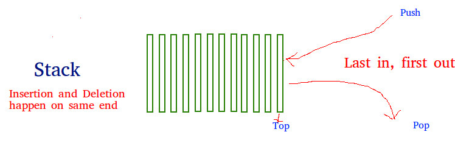
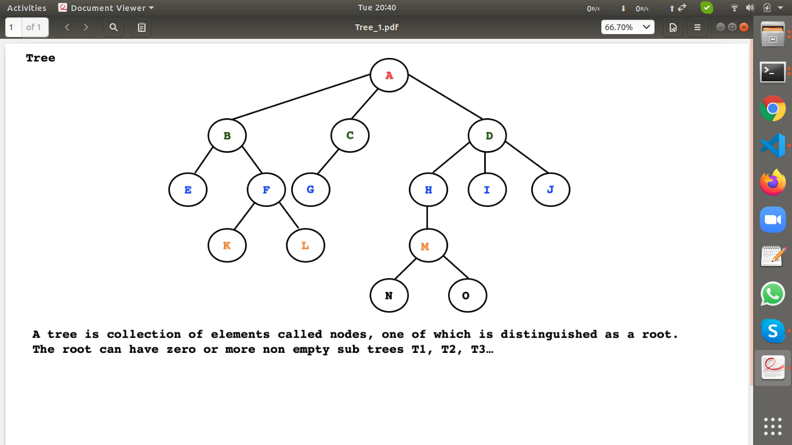
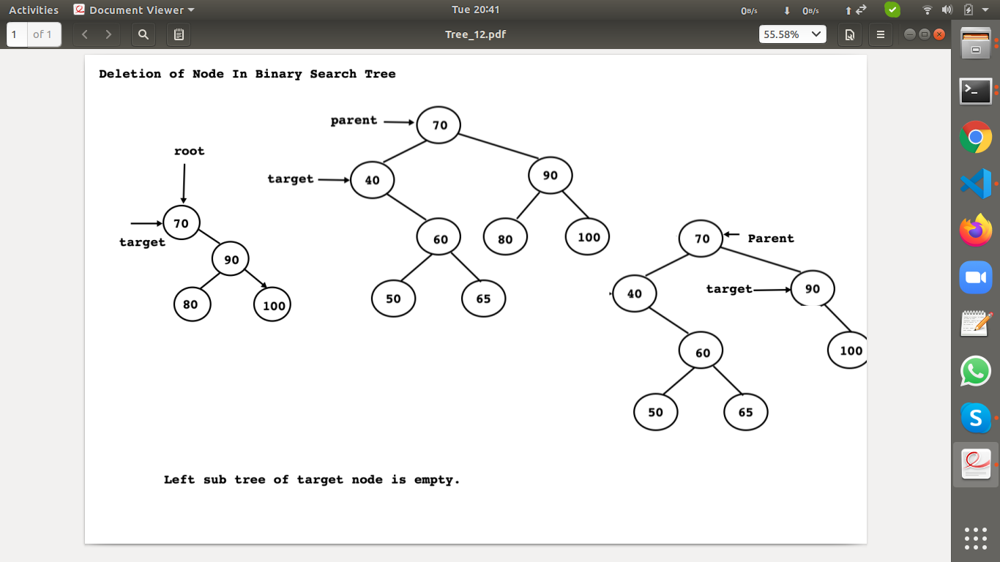
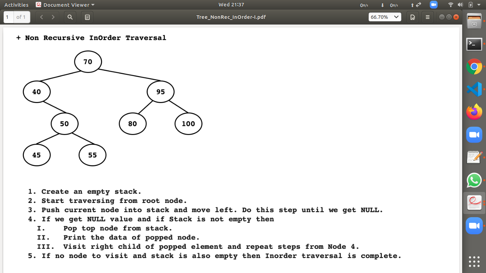
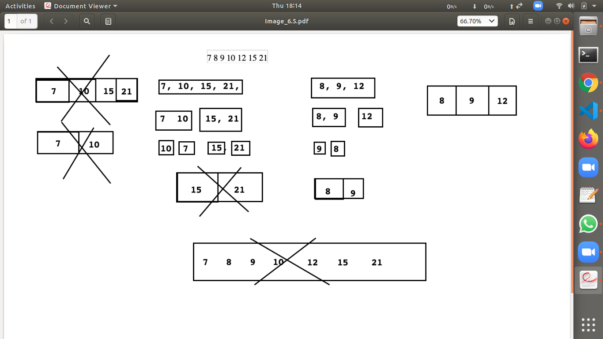

# ADS syllabus
* C++ 03 Standard

# reference 
> https://www.tutorialspoint.com/data_structures_algorithms/avl_tree_algorithm.htm
> 
### Data Structure
* It is branch of computer science which is  used to organize data efficiently in RAM.
* Types of data structure
    1. Linear/Sequential Data Structure
        - Array
            * Single dimensional Array
            * Multidimensional Array
        - Stack
        - Queue
            * Linear Queue
            * Circular Queue
            * Priority Queue
            * Deque
        - LinkedList
            * Singly Linked List
                - Linear Singly Linked List
                - Circular Singly Linked List 
            * Doubly Linked List
                - Linear Doubly Linked List
                - Circular Doubly Linked List
    2. Non Linear Data Structure
        - Hashtable
        - Tree
        - Graph
### Algorithm
* It is branch of computer science which is used to process data strored in data structure.
* Classification
    - Searching Algorithm
        1. Linear Search
        2. Binary Search
        3. Hashing
    - Sorting Algorithm
        1. Bubble Sort
        2. Selection Sort
        3. Insertion Sort
        4. Merge Sort
        5. Quick Sort
        6. Shell Sort
        7. Radix Sort
        8. Heap Sort


# day1


## to do 
1. menu driven program for vector function 

## notes

1. Arrays
 + array is a linear data structue, or collection
 + in which we can store element of same type in continous memory location
     +  where value or data stored in data structure is called element   
 + if we want to access elements from array, then we should use integer index
 + Array index always begins with 0. 
* 2. Array BOunds 
 + min index and max index 
 + Min index : 0
 + Max index : SIZE - 1
* in C/C++ , checkign array bounds checking is job of a programmer
* types of Array": 
 1. Single Dimensional Array
 2. Multi Dimensional Array

* Advantages of array: 
 1. random access
 + if we know index of element, then we can access it, very fast

* Limitation of Array: 
 1. we cannot resize array.
 2. it requires continuous memory . 
 3. Compiler do not check array bounds 
 4. element isnertioon and deletion takes more time in a array
 5. using assignment operator, we cannot copy one array into another arra
 +  need memcpy() in c++ or loop to copy one array to another    
 + to overcome, Array, we can use Linked list 

2. Vector

# 3. Linked List : data structure
 + linked list is a linear data strucure,which is collection of elements
   + where each element is called a node
* 1. Node 
  + here node, is a element, which can have 
    + object of node class has 2 part or 3 part,where
    + 2 parts are int data and node* next
    + 3 parts are node* prev, int data ,node* next  
  + where , 
    + data --> data stored for number is of type integer
    + next,prev, --->  contain address of next node object, so type of node is node*   
  + node is a object which may contain either 2 parts /3 parts depending on type of linked list
```c++

Class Node 
{
Node* prev ;
int data; 
Node* next;

}

// OR
Class Node 
{
int data; 
Node* next;

}

```
* 2. Types of linked list
 1. Singly LinkedList(SLL)
  + in a linked  list, if node(element) contains two part
   1. a element(data) 
   2. a pointer which is address of next node object 
   + is callled singly LL 
 2. Doubly Linked List(DLL)
 + in a linked listm if node contains three parts
  1. a pointer which contains address of previous node object(prev)
  2. a element(data)
  3. a pointer which contains address of next node object(next)
  + is called doubly linked list
* 3. Node Object
  1. Head
   + In a LL, head is a pointer, which is designed to store address of first node object
   + if value of head is null, then LL is considered as empty
   ```c++
    bool empty(){
       return head == NULL
    }
   ``` 
   2. Tail
   + In a LL, tail is a pointer which is designed to store address of last node object    
* 4. Singly and DOubly LL are further classified into two types: 
  1. Linear LL 
  2. Circular LL 


* 5. Linear Singly Linked List ( L-SLL)
  +  if next pointer of tail node , contains NULL is call singly list
  +  in a SLL, if next pointer of last node object contains NULL value, then such a LL is called L-SLL      


* 6. Circular Singly Linked List(C-SLL)
  +  in a SLL, if next pointer of last node object contains address of first node, then such a LL is called C-SLL


* 7. Liner Doubly Linked List(L-DLL)
  + in a DLL, if prev pointer of first node and next pointer of last node contains NULL values then it is called as L-DLL 

* 8. Circular Doubly Linked List(C-DLL)   
  +  in a DLL, if prev pointer of first node contains address of last  and next pointer of last node contains address of first node then it is called as C-DLL


# day2 

## to do 
1. list in c++ stl 
## classwork notes

1. linked list and node class
```cpp
class LinkedList; 
class Node{

private: 
 int data;
 Node *next; 
public: 
 Node (int data = 0) : data(data), next(NULL)
 {}

 friend class LinkedList; 

};

class LinkedList{

private: 
Node *head;
Node *tail; 


```

### 4. we can perform following Operations on Singly Linked List
* 3 condition to consider 
+ 1. list list is empty i.e no node
+ 2. list has one node 
+ 3. list has more than one node 
1. bool empty()
```cpp
bool empty(void) const throw()
{
    return this->head == NULL;   
}
```
2. void addFirst(int data) throw(bad_alloc)

```cpp
void addFirst(int data) throw(bad_alloc)
{
    // add data to LL , using node, by creating a node object 
    Node *newNode = new Node(data); 
    // NULL in next by default : is value of next 
    // in Linked list, two element : head and tails (with value Null)
    // i.e LINKED LIST EMPTY
    if(this->empty())
    {
         this->tail = newNode; 
        //  this->head = newNode; 
         
    }else
    { 
        newNode->next = this->head; 
       // this->head = newNode; 
    }
     this->head = newNode; 
}
```
3. void addLast(int data) throw(bad_alloc)

```cpp
void addLast(int data) throw(bad_alloc)
{
    // add data to LL , using node, by creating a node object 
    Node *newNode = new Node(data); 
    // NULL in next by default : is value of next 
    // in Linked list, two element : head and tails (with value Null)
    // i.e LINKED LIST EMPTY
    if(this->empty())
        // this->tail = newNode; 
         this->head = newNode;  
    else
     this->tail->next = newNode;
     // use tail pointer to add node at last and upate tail
    
     this->tail = newNode; 
}
```
4. int addAtPosition(int position,int data) throw(bad_alloc, Exception)

```cpp
void addAtPosition(int position,int data) throw(bad_alloc)
{                        
   
  if(position <= 0 )
  {
    throw Exception("Invalid Position"); 
  }else if(position == 1)
  this->addFirst(data); 
  else if(position > this->nodeCount())
  this->addLast(data); 
  else{

      Node *trav = this->head; 

      for(int count = 1; count < position - 1; ++ count)
      { 
          trav = trav->next;         
      }

      Node *newNode = new Node(data); 
      
      newNode->next = trav->next; 
      trav->next = newNode; 

  }                                 
}      
```
5. void removeFirst() throw(Exception)

```cpp
void removeFirst(void)
{
    if(this->empty())
    {
        throw Exception("LinkedList is empty"); 
    }else if(this->head == this->tail)
    { 
        delete this->head; 
        this->head = this->tail = NULL; 
    }else
    {
       // this->head = this->head->next; 
       Node *ptrNode = this->head; 
       this->head = this->head->next; 
       delete ptrNode; 
      // notrequired as pointer has local spoce, no need for null
       ptrNode = NULL;
        
    }
    
```
6. void removeLast() throw(Exception)

```cpp
void removeLast() throw(Exception )
{
 
     if(this->empty())
    {
        throw Exception("LinkedList is empty"); 
    }else if(this->head == this->tail)
    { 
         delete this->head; 
         this->head = this->tail = NULL; 
    }else
    {
       Node *trav = this->head; 

       while(trav->next != this->tail)
       {
           trav = trav->next; 
       }
        delete this->tail; 
        this->tail = trav; 
        this->tail->next = NULL; 
    }
}
```
7. removeFromPosition(int position) throw(Exception)

```cpp
void removeFromPosition(int position) throw(Exception) 
{
    if(position < 0 )
    {
        throw Exception("Invalid address "); 
    }else if(position == 1)
    this->removeFirst();
    else if(position >= this->nodeCount())
    this->removeLast(); 
    else
    {
        Node *trav = this->head; 
        for(int count = 1; count < position - 1;++ count)
        {
              trav = trav->next; 
        }
         Node *ptrNode = trav->next; 

        trav->next = ptrNode->next; 
        delete ptrNode; 
        
    }
    

}
```
8. iterate/print linked list
```cpp
void printList(void){


    if(this->empty())
    throw Exception("LinkedList is empty"); 
    else{

        Node *trav = this->head;

        while(trav != NULL)
        {
            cout <<trav->data <<" "; 
            trav = trav->next; 

        }
        cout<<endl; 
    }
}
```
9. void clear() throw()
```cpp
```
10.  int  nodeCount()
```cpp
int nodeCount() const throw() 
{

   Node *trav = this->head; 
     int count = 0; 
   while(trav != NULL)
   {
      ++count; 
       trav = trav->next; 
   }
 return count; 

}
```
11. ~LinkedList(void)
* use valgrind , to check memory leakage
* as we didnt write destuctor so showing memory leakge 
* after destructor , valgrind shows 
>  All heap blocks were freed -- no leaks are possible
 >valgrind ./filename.out 
 ```cpp
~LinkedList(void)
{
    while(!this->empty())
    {
        this->removeFirst();
    }
}
 ```     


## 5.  list class in stl 
```cpp
#include<iostream>
#include<list>

using namespace std;

int main(void) 
{
    list<int> intList; 

    intList.push_front(10); 
    intList.push_back(20); 
    intList.push_back(30); 
    intList.push_back(40); 
     intList.push_back(50); 
    intList.push_back(60);
intList.pop_back();
    intList.pop_front(); 


    for(int element : intList)
    cout<<element<<"  "; 
    return 0; 
}

```
## 6. iterate list in non member function 
* create iterator class itrStart and itrEnd  

```cpp

```
## Reverse Linked List
* using recursion 
* using 3  pointers

```cpp
 void reverse(void) throw(Exception)
        {
            if(this->empty())
            throw Exception("LinkedList is empty");
           
           Node *trav = this->head; 

           Node* current;
           Node* previous = NULL;  
           while(trav != NULL)
           {  current = trav; 
               trav = trav->next; 
                current->next = previous; 
                 previous = current; 
            
           }

           this->tail = this->head; 
           this->head = previous; 

        }

```

## 7. Add node before address of node given


## 8. Delete,node whose  given address before node


## 9. Limitation of S-LL
1. in a Linear SLL, we cannot re-visit previous node . 
+ so to overcome it, we must store  address of first node inside next pointer of last node 
i.e use C-SLL. 

## 10. Circular Singly LL (C-SLL)
* if next pointer of last node contains address of first node it is called C-SLL. 
* tail pointer always stores address of first node
* head pointer always stores address of last node
* Last Node's next pointer => this->tail->next
* First Node's address => this->head
> this->tail->next = this->head; 


### 11. function in which changes be there, from Linear-LL
1. function addFirst()


```cpp
void addFirst(int data) throw(bad_alloc)
{
    // add data to LL , using node, by creating a node object 
    Node *newNode = new Node(data); 
   
    if(this->empty())
     {
     this->tail = newNode; 
     

        // for liner
        // this->tail = newNode; 
        //  this->head = newNode; 
         
     } else
      { newNode->next = this->head; 
        //for linear
        //newNode->next = this->head; 
       // this->head = newNode; 
      }
       this->head = newNode;      
         this->tail->next = this->head; 
    // for linear
     // this->head = newNode; 
}

```
2. Add Last

```cpp
void addLast(int data) throw(bad_alloc)
{
  
    Node *newNode = new Node(data); 
   
    if(this->empty())
    {
        this->head = newNode; 
       // for linear

        // this->tail = newNode; 
       //  this->head = newNode;  
    }
    else{
        this->tail->next = newNode;      
        // for linear
       //  this->tail->next = newNode;
     // use tail pointer to add node at last and upate tail
    }
    this->tail = newNode; 
       this->tail->next = this->head; 
    // for linear
    // this->tail = newNode; 
}
```

3. Remove First

```cpp
void removeFirst(void) throw(Exception )
{
    if(this->empty())
    {
        throw Exception("LinkedList is empty"); 
    }else if(this->head == this->tail)
    { 
            delete this->head; 
            this->head = this->tail = this->tail->next = NULL; 

       // for linear 
        //delete this->head; 
        //this->head = this->tail = NULL; 
    }else
    {
      Node *ptrNode = this->head; 
      this->head = this->head->next; 
      delete ptrNode;
      this->tail->next = this->head;  
     

// for linear
       // Node *ptrNode = this->head; 
       // this->head = this->head->next; 
       // delete ptrNode; 
      // notrequired as pointer has local spoce, no need for null
      // ptrNode = NULL;
        
    }
    
 
}
```

4. for Remove last
* change in one line 
>  this->tail->next = this->head; 
    
5. count node in link list

```cpp
int nodeCount() const throw() 
{
  int count = 0;
  if(!this->empty())
  {
     Node *trav = this->head; 
     do
     {
         ++ count; 
         trav = trav->next; 
     } while (trav != this->head);
  }
 return count; 
}

```


## 12.  Limitatio of C-Singular-LL
1. in a C-SLL, to visit previous node, we need to traverse complete linked list, which is time consuming 
+ to overcome this limitation, we should use doubly linked list


## 13. Doubly LL
1. in a Node
```cpp
class Node{

private: 
Node *prev; 
 int data;
 Node *next; 
public: 
 Node (int data = 0) : data(data),prev(NULL), next(NULL)
 {}
 friend class LinkedList; 
};

```
 
## 4. we can perform following Operations on Singly Linked List
* 3 condition to consider 
+ 1. list list is empty i.e no node
+ 2. list has one node 
+ 3. list has more than one node 

1. void addFirst(int data) throw(bad_alloc)

```cpp
void addFirst(int data) throw(bad_alloc)
{
   
    Node *newNode = new Node(data); 
  
    if(this->empty())
    { 
        this->tail = newNode;              
    }else
    { 
        newNode->next = this->head; 
        this->head->prev = newNode; 

    }
    this->head = newNode; 
}
```
2. void addLast(int data) throw(bad_alloc)

```cpp
void addLast(int data) throw(bad_alloc)
{
   
    Node *newNode = new Node(data); 
  
    if(this->empty())
       { 
           this->head = newNode;
       }
        
    else
  { 
      this->tail->next = newNode; 
      newNode->prev = this->tail;      
  }
    this->tail = newNode; 
     
}
```
3. int addAtPosition(int position,int data) throw(bad_alloc, Exception)

```cpp
void addAtPosition(int position,int data) throw(bad_alloc)
{                        
   
  if(position <= 0 )
  {
    throw Exception("Invalid Position"); 
  }else if(position == 1)
  this->addFirst(data); 
  else if(position > this->nodeCount())
  this->addLast(data); 
  else{

      Node *trav = this->head; 

      for(int count = 1; count < position - 1; ++ count)
      { 
          trav = trav->next;         
      }

      Node *newNode = new Node(data);
        
      newNode->prev = trav; 
      newNode->next = trav->next; 
      trav->next = newNode;
      trav->next->prev = newNode;  

  }
```
4. void removeFirst() throw(Exception)

```cpp
void removeFirst(void) throw(Exception )
{
    if(this->empty())
    {
        throw Exception("LinkedList is empty"); 
    }else if(this->head == this->tail)
    { 
        delete this->head; 
        this->head = this->tail = NULL; 
    }else
    {
            Node *ptrNode = this->head; 

                this->head = this->head->next; 
              this->head->prev = NULL; 
              delete ptrNode; 

              ptrNode = NULL;    
        
    }
    
 
}
    
```
5. void removeLast() throw(Exception)

```cpp
void removeLast() throw(Exception )
{
 
     if(this->empty())
    {
        throw Exception("LinkedList is empty"); 
    }else if(this->head == this->tail)
    { 
         delete this->head; 
         this->head = this->tail = NULL; 
    }else
    {
        this->tail = this->tail->prev;

        delete this->tail->next; 

        this->tail->next = NULL;
           
    }
}
```
6. removeFromPosition(int position) throw(Exception)

```cpp
void removeFromPosition(int position) throw(Exception) 
{
    if(position < 0 )
    {
        throw Exception("Invalid address "); 
    }else if(position == 1)
    this->removeFirst();
    else if(position >= this->nodeCount())
    this->removeLast(); 
    else
    {
        Node *trav = this->head; 
        for(int count = 1; count < position - 1;++ count)
        {
              trav = trav->next; 
        }
         Node *ptrNode = trav->next; 
         
         ptrNode->next->prev = trav; 

         trav->next = ptrNode->next; 
         delete ptrNode; 
         
       
        
    }
    

}
```
7. iterate/print linked list
```cpp
void printList(void){


    if(this->empty())
    throw Exception("LinkedList is empty"); 
    else{

        Node *trav = this->head;

        while(trav != NULL)
        {
            cout <<trav->data <<" "; 
            trav = trav->next; 

        }
        cout<<endl; 
    }
}
```
8. void clear() throw()
```cpp
```
9.  int  nodeCount()
```cpp
int nodeCount() const throw() 
{

   Node *trav = this->head; 
     int count = 0; 
   while(trav != NULL)
   {
      ++count; 
       trav = trav->next; 
   }
 return count; 

}
```
10. ~LinkedList(void)
* use valgrind , to check memory leakage
* as we didnt write destuctor so showing memory leakge 
* after destructor , valgrind shows 
>  All heap blocks were freed -- no leaks are possible
 >valgrind ./filename.out 
 ```cpp
~LinkedList(void)
{
    while(!this->empty())
    {
        this->removeFirst();
    }
}
 ```     


## Limitation for Linear D-LL
* cant travel from one node to prev nodes, directly 

# day3

## to do 
1. Complexity 
2. Stack stl 
3. Evaluate infix to  prefix and postfix, so number of time push and pop takes place
4.  integer conversion to binery equivalent
```cpp
#include<iostream>
using namespace std; 
int main ()
{
    int num, bin;
    cout << "Enter the number : ";
    cin >> num;
    cout << "The binary equivalent of " << num << " is ";
    while (num > 0)
    {
        bin = num % 2;
        cout << bin;
        num /= 2;
    }
    return 0;
}
```
5.  how to balance parantesis
* 1. String of parenthesis is given for example “((())) “ or ({}) etc. and we need to find out if they are balanced. Means, if there are matching pairs or not.
* 2. for example, ({}) is balanced parentheses and ((((()) is not a balanced parenthesis.
* 3. Algorithm:
  + 1. Traverse the expression string
  + 2. If the current character is a opening bracket or parenthesis e.g. ‘(‘ or ‘{‘ or ‘[‘  then push in the stack.
  + 3. If the current character is a closing bracket e.g ‘)’ or ‘}’ or ‘]’ then  pop a character from  the stack and check if it is a corresponding parenthesis, if matched then pop it from stack.
  + 4. Once, string traversal is complete then check if stack is empty or not. If the stack is empty parenthesis are balanced.
 
* 4. Time Complexity: O(n) – traverse string of n length.
* 5. Space complexity O(n) – Due to Stack

 


## notes
* Data Structure describe two things : 
1. How to organize data inside RAM(memory representation)
2. Which Operations are required to organize data inside RAM(opearations)

### Stack 

1. A stack is linear/sequential Data  Structure in which we can manage elements in 
   + Last In First Out order(LIFO)
2. we can implement Stack using : 
+ 1. Array 
+ 2. LinkedList
  * addFirst (push)
  * removeFirst(pop)
  * getFirst("peek")
+ 3. Deque("Deck)  
  * peekFront (peek)
  * enqueFront (push)
  * dequeFront (pop)

3. Stack DS  

*  1.  top is index varaible  for a stack
+ its value by default by -1 
*  2. to insert element , 
+ need to increment top 
*  3.  so stack will be empty when 
+ top = -1
*  4. stack will be full 
+  when top = SIZE - 1
+ where Size = size of stack (from 0 to size -1)
*  5. 

4. we can perform following operation on Stack
+ 1. empty
   * If value of top is -1 then stack is considered as empty
   * Syntax : 
   > bool empty(void) const throw(); 
+ 2. full 
   * if value of top is "array size - 1" then stack is considered as full 
   * Syntax: 
   > bool full(void ) const throw ()
+ 3. push 
  * if we want to insert new element inside stack then we should push function 
  * FIrst Increment top and then insert new element
  * Syntax: 
  > void push (int element) throw(Exception)      
+ 4. peek
   * if we want to get values from stack top (where top is pointing ) then we should use peek function
   * it is inspector/selector/getter function which do not modify state  of Stack
   * Syntax: 
   > int peek(void) throw(Exception) 
+ 5. pop  
  * if we want to remove element from stack, then we should use pop function 
  * Remove element and decrement top.
  * Syntax : 
  > void pop (void) throw(Exception)


5. Application of stack 
* programatic example
1. To maintain function activation record 
2. Expression conversion and their eveluation 
  + Infix to prefix
  + Infix to postfix
3. for the implementation of Depth First Traversal/ Search (DFS) algorithm 
4. For parenthesis balancing 
5. To convert integer into binary format   
6. to reverse string 

7. to implement undo and redo function
8. to show call history in call logs
9. to list email and sms 
10. Recent files function 

## . Expression
1. A statement which contians variable .constant and operator is called Expression
2. Forms of Expression 
+ 1. Infix E
   * operator in between operand
   * Example  : a + b 
+ 2.  Prefix E 
  * Operator is before operand 
  * Example : + a b
+ 3.  Postfix E 
  * Operator is after operand 
  * Example : a b +

* compiler uses any one form of expression , as it cant understand expression in general 
* trick to remember precedence table : 
+ PUMA S REBL TACO 
3. Expression 
* INFIX TO PREFIX 

 1. INFIX TO PREFIX 
 *  to convert  Infix to prefix: a + b * c - d / e
 - 1.  consider precidence of operator BODMAS|(bracket of Div mult add sub) 
 - so expression 
  + a + *bc - d/e 
  + a + *bc - /de
  +    +a*bc -/de
  +    -+a*bc/de

 *  Infix to prefix
+ COnsider  infix Expression: "5 + 3 * 9 / (7 -4) - 6 * 2"
+   prefix :  -+5/*39-74*62

2.  INFIX TO POSTFIX 

*  to convert Infix : a + b *c -d /e
+ to Postfix 
+ =>    a + bc* -d/e
+ => a + bc* - de/
+ => abc*+ -de/
+ => abc*+de/- 

* so for expression 
```cpp
 infix => 5+ 3 * 9 / (7-4) - 6 * 2 

post fix =>   5 + 3 * 9 / 74- - 6 * 2
        => 5 + 39* / 74-  - 6 *2
        =>  5 + 39*74-/ - 62*
        =>  539*74-/+ - 62* 
        =>   539*74-/+62*-


```


# 3.  Queue 


1. A Queue is linear/sequntial data structure in which we can manage element in First In First Out (FIFO) order.
*  A good example of a queue is any queue of consumers for a resource where the consumer that came first is served first. The difference between stacks and queues is in removing.
*   In a stack we remove the item the most recently added; in a queue, we remove the item the least recently added.
2. We can perform following operations on queue: 
-  
1. empty
2. full 
3. enqueue 
4. dequeue 
5. peek 

3. Types of Queue 
+ 
1. Linear Q
2. Circular Q
3. Priority Q 
4. Deque

## Linear Queue 
* we can iimplement linear queue using array as well as LinkedList. 

* 1.  Linked List implementation using (Linear Singly Linked list)
+ 1. addlast()
+ 2. removeFirst()


* 2.  **Array implementation**
1. empty
+ if value of rear is -1, or value of front is greater than read than linear Q is considered as empty
+ syntax: bool empty(void) const throw(); 

2. full
+ if value of read is "Array size - 1  " then linear queue is considered as full
+ snytax: bool full(void)
3. enqueue 
+ use to insert element in queue
+ increment rear and insert value
+ syntax : void enqueue(int element) throw(Exception); 
4. dequeue
+  it is used to remove element from queue 
+  Syntax : void dequeue (void) throw (Exception)
5. peek
+ used to get value from front end . 
+ Syntax  : int peek(void) const throw(Exception)

### Limitation 
* after deletion of elements from queue, even though it is empty, we cannot use that space. so to overcome this   
## Circular Queue
1. if we want to overcome limitation of linear queue then we should use C-Queue 

* we can iimplement linear queue using array as well as LinkedList. 

* 1.  Linked List implementation using (Circular Singly Linked list)
+ 1. addlast()
+ 2. removeFirst()


* 2.  **Array implementation**
1. empty
+ if value of rear is -1, than read than C Q is considered as empty
+ syntax: bool empty(void) const throw(); 
1. full
+ if value of  
>  (rear + 1) % size == front
+ then C queue is considered as full
+ snytax: bool full(void)
3. enqueue 
+ use to insert element in queue
+ increment rear and insert value
+ syntax : void enqueue(int element) throw(Exception); 
4. dequeue
+  it is used to remove element from queue
+  increment front by 1;  
+  Syntax : void dequeue (void) throw (Exception)
5. peek
+ used to get value from front end . 
+ Syntax  : int peek(void) const throw(Exception)

## Priority Queue 


## Deque(Double ended Queue)
1. to implement using array
+ 1. enqueueFront() : 
> rear = (rear + 1) % size
+ 2. enqueueBack()  : 
> >  front = (front - 1 + this->size) % size

+  3.  dequeueFront() :
  >  front = (front + 1) % size
+ 4.  dequeueBack()  :
> rear = (rear - 1 + this->size) % size
+ 5.  peekFront() : 
> use front
+ 6.  peekBack() :
>  use rear


# day4

0. Linked List is sequential data structure ,which is collection of nodes
## Tree 
1. Tree is non sequential , non linear data structure which is collection of nodes
2. Tree contains: 
   1. A special node is caleed root
   2. zero or more sub trees 
3. A tree data structure can be defined recursively as a collection of nodes (starting at a root node),
+  where each node is a data structure consisting of a value, together with a list of references to nodes (the "children"), with the constraints that no reference is duplicated, and none points to the root.

4. In Image "Tree_1.pdf" A is root node which has 3 sub trees (B,C,D)
5. If we want to store data in hierarchical order then we should use tree.
+ it help us to search data easily 


### Basic Tree Terms
1. Root 
 + it is a special node in a tree, through which we can traverse entire tree. 
 + In Image "Tree_1.pdf" , Node A is a root node. 
 + Root node do not have parent node. 

2. Parent Node
 + An Immediate predecessor of any node, is called parent node . 
3. Child Node
 + An immediate successor of any node, is called child node
 + eg: 
 ```
 child : parent node 
 node/
siblings
 B,C,D : A

 E,F : B

 G : C 

 K,L : F
 M : H
 N,O : M 
```

4. Siblings 
 + Nodes with same parent are siblings 

5. Edge
 + Link between two nodes is called edge

6. Path 
 + Number of Successive edges from source node to destination node, is called path. 
 +  path is  the sequence of nodes along the edges of a tree
 + Path between A to N is, A -D, D-H,H-M-M-N

7. Degree of node
 + no of child node of a parent node represent degree of a node. 
 
 ```
 Node                Degree of a node 
 - E,K,L,G,N,O,I,J : 0 (leaf node / external node )
 - C,H :           : 1  } (rest are internal node)
 - B,F,M           : 2  }
 - A,D             : 3  } 
 ```
8. Leaf Node/ terminal node 
 + a node whose degree is zero is called leaf node / external node 
 >  - E,K,L,G,N,O,I,J : 0 (leaf node / external node )
 + rest are internal node
9. Level of Node
+ A level of a  node in a tree is defined as 
  1. Level of root node is 0
  2. Level of any other node in a  tree is one more than level of its parent 

```
NODE           LEVEL 
A             | 0 
B,C,D         | 1
E,F,G,H,I,J   | 2
K,L,M         | 3
N,O           | 4   

```
10. Depth 
 + maximum level of anynode in a tree is called as depth of a tree
 + Maximum depth of a tree mentioned in diagram is 4 . 
  
11. Internal Node/branch node 
 + An internal node (also known as an inner node, inode for short, or branch node) is any node of a tree that has child nodes.

12. Tree Ancestor
 
 + starting from root , till specific node ,
+ All the predecessors in the path from source/root node to destination node are called as Ancestor

 ```
 Node           | Ancestor
 B,C,D          | A
E,F,            | B,A
G,              | C,A
H,I,J           | D,A
K,L             | F,B,A
M               | H,D,A 
N,O             | M,H,D,A


 ```

1.  Tree Descendant 
+ All the nodes which are reachable from specified node are its Descendant. 
```
 Node              | DESCENDENT                
 - E,K,L,G,N,O,I,J |  No descendent 
 - F               |  K,L 
 - C               | G  
 - M               | N.O
 - B               | E,F,K,L 
 - H               | M,N,O
 - D               | H,I,J,M,N,O
 - A               | ALL NODES

```
14. Height of Node 
+ The height of a node is the length of the longest downward path to a leaf from that node. 
+ The height of the root is the height of the tree. 
```
 Node              | Height  (H)             
 - E,K,L,G,N,O,I,J | leaf node(H = 0)
 - F               | 1  
 - C               | 1   
 - M               | 1 
 - B               | 2 
 - H               | 2 
 - D               | 3 
 - A               | 4

```

15. height of Tree 
 + Height of root Node is considered as height of tree
 +  in diagram, heihgt of tree is 4.  


### Types of Tree
1. Type of tree
   1. General Tree 
   2. Binary Tree
   3. Null Tree  

2. General Tree
+ in a tree if there is no restriction on number of sub trees then it is called general tree
+ Consider Image from "Tree_2.pdf" 

3. Binary Tree
+ In a Tree , if node can have at most 2 sub trees then it is called binary tree. 

4. NULL Tree
+  If a tree do not contain any node then such tree is called null tree   


### Types of Binary Tree

1. Full Binary Tree
2. Complete Binary Tree
3. Skewed Binary Tree
  + Left Skewed Binary Tree
  + Right Skewed Binary Tree
4. Strictly Binary Tree  


####  explanations 

5. Full Binary Tree
+ it is a tournament tree  
+  A binary tree is said to be full binary tree if each node has 2 child node . 
+   In full binary tree : 
  1. Every non leaf node must have , non empty left sub tree and 
    and non empty right sub tree
  2. All the leaf nodes must exist at same level . 

6. Complete Binary tree 
 + in complete binary tree: 
  1. every level must be filled from left to right
  2. Leaf node can exist at level n or n-1
  + where n : is leaf node level possibilities 
 + every full binary tree is a complete binary tree, 
 + but every complete binary tree is not full binary tree 


7. Skewed Binary Tree
 + In a binary Tree, either all the left sub trees or right sub trees are empty, then such binary tree is called Skewed Binary tree. 
 1. Left Skewed Binary Tree 
 + In a binary tree, if, right sub tree of each node is empty then it is Left Skewed binary tree
 2.  Right Skewed Binary Tree 
 + In a binary tree, if, left sub tree of each node is empty then it is Left Skewed binary tree

 


8. Strictly Binary Tree
 + In strictly binary tree : 
   1. Every non leaf node, must have, non empty left sub tree and non empty right sub tree 
   2. Leaf Node can exist at any level . 
 + Every full binary tree is strictly binary tree, but every strictly binary tree is not full binary tree 


### Tree Trqaversal Techniques

1. Depth First Search (DFS) Traversal (stack)
+ implicitely uses **Stack** 
  1. PreOrder    Traversal (V-L-R)
  2. InOrder Traversal  (L-V-R)
  3. PostOrder Traversal (L-R-V)

2. Breadth First Search (BFS) Traversal  (queue)
+ implicitely uses **Queue** 
  4. Level Order Traversal (level by level)

#### Explanation 

1. PreOrder Traversal 
+ Algorithm is : 
  1. Visit parent node (V)
  2. Visit Left Sub Tree (L)
  3. Visit Right Sub Tree(R)
+ Preorder Traversal : V-L-R

* SOLVE
```
1. TO SOLVE 
A --> B,C 
B---> D,F
C---> F,G 

- A + P[B] + P[C]
- A + [B + P[D] ] + [C + P[E] + P[F]]
- A + [B + D + P[G] + P[H]] + [C + E + F]
- A + [B + D + G + H] + C + E + F] 
 : PREORDER T: --> ABDGHCEF 

```
2. InOrder Traversal

+ Algorithm is : 
 
  1. Visit Left Sub Tree (L)
   2. Visit parent node (V)
  3. Visit Right Sub Tree(R)
+ Inorder Traversal : L-V-R

* SOLVE
```
1. TO SOLVE 
A --> B,C 
B---> D,F
C---> F,G 

InOrder = I 

- I[B] + A + I[C]
 
 - [ I[D] + B + I[E]] + a + [I[F] + C + I[G]]
 -[ D,B, E, A F,C,G ]
 
 QUESTION TO SOLVE 

 - 
 -

```

3. PostOrder Traversal

+ Algorithm is : 
  
  1. Visit Left Sub Tree (L)
  2. Visit Right Sub Tree(R)
  3. Visit parent node (V)
+ Postorder Traversal : L-R-V
* SOLVE

```
PostOrder : P 
1. TO SOLVE 
A --> B,C 
B---> D,F
C---> F,G 
LRV
-  P[B] + P[C] + A 

- P[D] + P[E] + B] + [P[F] + P[G] + C]  + A 
- [D + E + B ] + [F + G + C] + A 
- d,E,B,F,G,C,A 

2. TO SOLVE

- P[B] + P[C]  + A
- [P[D] + B] +  [P[E] + P[F] + c ] + A
- [ P[G] + P[H] + D ] + [ [E] + [F] + C] + A
- G,H,D,E,F,C,A

```
4. Level Order Traversal
+ Algorithm is : 
1. Visit every level Left oright
+ level order Traversal : level by level 
* SOLVE
```
FOR IMAGE 7

- A
- B,C
- D,E,F
- G, H
- A,B,C,D,E,F,G,H
```

### Binary Search Tree 
+ only unique element 
+ first element is root element 
+ after root , considered as
  1.  left sub tree
    + condition for element 
     > left->data < root->data 
  2.  right sub tree 
   +  condition for element : 
   >  right->data > root->data

* it is a binary tree, which must use following rules: 
 1. All the elements in a tree must be distinct
 2. First element will be considered as root node
 3. if value of node is less than parent node , then it should get space in left sub tree
 4. if value of node is greater than parent node, then it should get space in right sub tree

### Tree Operations

1. empty 

2. addNode

3. deleteNode

4. preOrder();

5. inOrder();

6. postOrder();

7. clear(); 


#### Deletion of Node In Binery Search Tree 




## Tree

1. Binary tree
* Node and Binary search tree class
```cpp
#include<iostream>
#include<string>
using namespace std;
namespace collection
{
	class BSTree;	//Forward declaration
	class Node
	{
	private:
		Node *left;
		int data;
		Node *right;
	public:
		Node( int data  = 0 ) : left( NULL ) ,data( data ), right( NULL )
		{	}
		friend class BSTree;
	};
	class BSTree
	{
	private:
		Node *root;
	public:
		BSTree( void ) throw( ) : root( NULL )
		{	}
		bool empty( void )const throw( )
		{
			return this->root == NULL;
		}
	void clear( Node *trav )
		{
			if( trav == NULL )
				return;
			this->clear( trav->left );
			this->clear( trav->right );
			delete trav;
		}
    	~BSTree( void )
		{
			this->clear( this->root );
			this->root = NULL;
		}

 ```

* addNode function 
 ```cpp   
		void addNode( int data )
		{
			Node *newNode = new Node( data );
			if( this->empty( ) )
				this->root = newNode;
			else
			{
				Node *trav = this->root;
				while( true )
				{
					if( data < trav->data )
					{
						if( trav->left == NULL )
						{
							trav->left = newNode;
							break;
						}
						trav = trav->left;
					}
					else
					{
						if( trav->right == NULL )
						{
							trav->right = newNode;
							break;
						}
						trav = trav->right;
					}
				}
			}
		}
```
* Pre Order, Post Order and InOrder Recursive Traversal
```cpp
		void preOrder( void)
		{
			this->preOrder( this->root );
		}
		void inOrder( void)
		{
			this->inOrder( this->root );
		}
		void postOrder( void )
		{
			this->postOrder(this->root );
		}
	
	private:
		void preOrder( Node *trav )
		{
			if( trav == NULL )
				return;
			cout<<trav->data<<"	";
			this->preOrder( trav->left );
			this->preOrder( trav->right );
		}
		void inOrder( Node *trav )
		{
			if( trav == NULL )
				return;
			this->inOrder(trav->left);
			cout<<trav->data<<"	";
			this->inOrder(trav->right);
		}
		void postOrder( Node *trav )
		{
			if( trav == NULL )
				return;
			this->postOrder( trav->left );
			this->postOrder( trav->right );
			cout<<trav->data<<"	";
		}

```

2. Deletion of Node In Binery Search Tree
* searchNode function
```cpp
    Node* searchNode(int data,Node *&parent)
    {
        Node * trav = this->root;
        parent = NULL; 
        while(trav != NULL)
        {
            if(data == trav->data)
            return trav; 
           parent = trav; 
            if(data < trav->data)
            trav = trav->left; 
            else
            {
                trav->right; 
            }
            
        }

        parent = NULL;
        return NULL; 
    }
```
* deleteNode function
```cpp
    void deleteNode(int data) throw(Exception)
    {
        Node *parent; 
       Node* target =  this->searchNode(data, parent) ;
        
      if(target->left != NULL && target->right != NULL  )
      {
          parent = target; 
          Node * successor = target->right;

          while(successor->left != NULL)
          {
              parent = successor; 
              successor = successor->left;
               
          }
          target->data = successor->data;
          target = successor;  


        
      }


        if(target != NULL)
        {
            if(target->left == NULL)
            {
                if(target == this->root)
                { 
                    this->root = target->right; 

                } else if(target == parent->left)
                {
                    parent->left = target->right; 


                } else
                {
                    parent->right = target->right; 
                }
                
            } else
            {
                if(target == this->root)
                { 
                   this->root = target->left; 

                } else if(target == parent->left)
                {
                  parent->left = target->left; 


                } else
                {
                    parent->right = target->left; 
                }

            }
            

        }
      delete target; 
    }
    
```

# day5 





1. Non Recursive PreOrder Traversal 
2. Non Recursive InOrder Traversal 
3. Non Recursive PostOrder Traversal 

### 4.  AVL Tree 
1. AVL tree is a self-balancing Binary Search Tree (BST) where the difference between heights of left and right subtrees cannot be more than one for all nodes.
2. here Balanced factor(bf) for problems
+ 1. incase of LL, and LR , bf are positive
+ 2. incase of RR and RL, bf are negitive 


## demo 

1. NOn Recursive Order Traversal
* Non  recersive preorder
```cpp


		void nonRecursivePreorder( void )
		{
			stack<Node*> stk;
			stk.push( this->root );
			while( !stk.empty( ) )
			{
				Node *trav = stk.top();	stk.pop( );
				if( trav != NULL )
					cout<<trav->data<<"	";
				if( trav->right != NULL )
					stk.push(trav->right );
				if( trav->left != NULL )
					stk.push( trav->left );
			}
			cout<<endl;
		}
 ```
* Non Recursive InOrder
 ```cpp   
		void nonRecursiveInorder( void )
		{
			stack<Node*> stk;
			Node *trav = this->root;
			while( trav != NULL || !stk.empty( ) )
			{
				while( trav != NULL )
				{
					stk.push( trav );
					trav = trav->left;
				}
				trav = stk.top();	stk.pop();
				if( trav != NULL )
					cout<<trav->data<<"	";
				trav = trav->right;
			}
			cout<<endl;
		}
 ```

* non R Post Order 
```cpp    
		void nonRecursivePostOrder( void )
		{
			stack<Node*> stk;
			Node *trav = this->root;
			do
			{
				while( trav != NULL )
				{
					if( trav->right != NULL )
						stk.push(trav->right);
					stk.push(trav);
					trav = trav->left;
				}
				trav = stk.top(); stk.pop();
				if( trav != NULL && !stk.empty( ) && trav->right == stk.top( ) )
				{
					stk.pop( );
					stk.push( trav );
					trav = trav->right;
				}
				else
				{
					cout<<trav->data<<"	";
					trav = NULL;
				}
			}while( !stk.empty( ) );
			cout<<endl;
		}
		
```


2. Recursive Order 

```cpp   
		void preOrder( void)
		{
			this->preOrder( this->root );
			cout<<endl;
		}
		void inOrder( void)
		{
			this->inOrder( this->root );
			cout<<endl;
		}
		void postOrder( void )
		{
			this->postOrder(this->root );
			cout<<endl;
		}
  private: 
  	void preOrder( Node *trav )
		{
			if( trav == NULL )
				return;
			cout<<trav->data<<"	";
			this->preOrder( trav->left );
			this->preOrder( trav->right );
		}
		void inOrder( Node *trav )
		{
			if( trav == NULL )
				return;
			this->inOrder(trav->left);
			cout<<trav->data<<"	";
			this->inOrder(trav->right);
		}
		void postOrder( Node *trav )
		{
			if( trav == NULL )
				return;
			this->postOrder( trav->left );
			this->postOrder( trav->right );
			cout<<trav->data<<"	";
		}

  ```

3. AVL Tree
* Add Node
```cpp
		void addNode( int data )
		{
			Node *newNode = new Node( data );
			if( this->empty( ) )
				this->root = newNode;
			else
			{
				Node *trav = this->root;
				while( true )
				{
					if( data < trav->data )
					{
						if( trav->left == NULL )
						{
							trav->left = newNode;
							break;
						}
						trav = trav->left;
					}
					else
					{
						if( trav->right == NULL )
						{
							trav->right = newNode;
							break;
						}
						trav = trav->right;
					}
				}
			}
			balance(this->root, NULL);
		}
```
* Search Node
```cpp    
		Node* search( int data, Node *&parent )throw( )
		{
			Node *trav = this->root;
			parent = NULL;
			while( trav != NULL )
			{
				if( data == trav->data )
					return trav;
				parent = trav;
				if( data < trav->data )
					trav = trav->left;
				else
					trav = trav->right;
			}
			parent = NULL;
			return NULL;
		}
```
* delete node
```cpp    
		void deleteNode( int data )throw( Exception )
		{
			Node *parent;
			Node *target = this->search( data, parent );
			if( target != NULL )
			{
				if( target->left != NULL && target->right != NULL )
				{
					parent = target;
					Node *successor = target->right;
					while( successor->left != NULL )
					{
						parent = successor;
						successor = successor->left;
					}
					target->data = successor->data;
					target = successor;
				}
				if( target->left == NULL )
				{
					if( target == this->root )
						this->root = target->right;
					else if( target == parent->left )
						parent->left = target->right;
					else
						parent->right = target->right;
				}
				else
				{
					if( target == this->root )
						this->root = target->left;
					else if( target == parent->left )
						parent->left = target->left;
					else
						parent->right = target->left;
				}
				delete target;
			}
			else
				throw Exception("Node not found");
		}
```
* level order
```cpp

		void levelOrder( void )
		{
			queue<Node*> que;
			que.push( this->root );
			while( !que.empty( ) )
			{
				Node *trav = que.front();	que.pop();
				if( trav != NULL )
					cout<<trav->data<<"	";
				if( trav->left != NULL )
					que.push(trav->left);
				if( trav->right != NULL )
					que.push(trav->right );
			}
			cout<<endl;
		}
 ```

 

* calculate height of tree
  ```cpp  
		int height( void )
		{
			return BSTree::height( this->root );
		}
	private:
		static int height( Node *trav )
		{
			if( trav == NULL )
				return -1;
			int leftHeight = height( trav->left );
			int rightHeight = height( trav->right );
			if( leftHeight > rightHeight )
				return leftHeight + 1;
			return rightHeight + 1;
		}
  ```

  * balancing AVL tree , 4 condition LL,RR,LR,RL
```cpp 
	private:
		
		static int balanceFactor( Node *node )
		{
			return BSTree::height( node->left ) - BSTree::height( node->right );
		}
		Node* llCase( Node *node, Node *parent )
		{
			Node *leftSubTree = node->left;
			node->left = leftSubTree->right;
			leftSubTree->right = node;
			if( node == this->root )
				this->root = leftSubTree;
			else if( node == parent->left)
				parent->left  = leftSubTree;
			else
				parent->right = leftSubTree;
			return leftSubTree;
		}
		Node* rrCase( Node *node, Node *parent)
		{
			Node *rightSubTree = node->right;
			node->right = rightSubTree->left;
			rightSubTree->left = node;
			if( node == this->root )
				this->root = rightSubTree;
			else if( node == parent->left)
				parent->left  = rightSubTree;
			else
				parent->right = rightSubTree;
			return rightSubTree;
		}
		Node* lrCase( Node *node, Node *parent )
		{
			node->left = rrCase(node->left, node);
			node = llCase(node, parent);
			return node;
		}
		Node* rlCase( Node *node, Node *parent )
		{
			node->right = llCase(node->right, node);
			node = rrCase(node, parent);
			return  node;
		}
		void balance( Node *node, Node *parent )
		{
			if( node == NULL )
				return;
			balance(node->left, node);
			balance(node->right, node);

			int balanceFactor =  BSTree::balanceFactor(node);
			if( balanceFactor > 1 )	//Consider Left SubTree
			{
				if( BSTree::balanceFactor(node->left ) > 0 )
					llCase( node, parent );
				else
					lrCase( node, parent );
			}
			else if( balanceFactor < -1 )	//Consider RightSubTree
			{
				if( BSTree::balanceFactor(node->right ) > 0 )
					rlCase( node, parent );
				else
					rrCase( node, parent );
			}
 		}
 ```

# day6 


# to do 


## notes

1. Searching 
* It is a process of finding location of element inside collection(Array,LinkedList,HashTable, etc)
* Following are commonly used searching techniques:
   1. Linear Search 
   2. Binary Search
   3. Hashing 


### Linear Search
1. Linear Search algorithm is also called as sequential search algorithm.
2. we can use it to search element in any sorted as well as unsorted collection. 
3. to search element in LInkedList, we use linear search algorithm
4. Advantages:
+ we can use it to search element in any sorted a well as unsorted collection
+ if collection contains less number of element, then it is considered as efficient
+ Easy to implement 

4. Limitation
+ If number of element are more , then it takes more time to search. 
+ Time required to search every element is different (non constant)

5. Implement linear search algorithm using recursion 
```cpp
   int find(int key)
    {
        for (int index = 0; index < this->size; index++)
        {
           if(arr[index] == key)
           return index;
        }
        return -1; 
        
    }

```

### Binary Search
1. if we want to reduce number of comparisons , then we should use, binary search algorithm. 
2. it uses divide and conquer algorithm technique 

3. Advantages
+ if we want to reduce number of comparisons then we should use binary search algorithm  

4. Limitation
+ To use binary search algorithm array/collection must be sorted
+ Time required to search every element is different (non cosntant)

5. Implement binary search using recursion 
```cpp
 int binarySearch(int key)
    {
        int left = 0;
        int right = this->size - 1; 

while(left <=right)
   {
        int mid = (left + right) / 2 ; 

        if(key == arr[mid])
        {
            return mid; 
        }else if( key <arr[mid])
        {
            right = mid - 1; 
        }else
        {
            left = mid + 1; 
        }

   }    
       return -1;  
    }


```

### Hashing 
0. In array we insert element, sequentially hence, it takes more time to search element 

+ Advantage of array over linked list: 
  *  we can access element of array randomly
    
 

1. It is a searching technique/algorithm, which is used to search element, in constant time. 
2. In other words, if we want to search any element very fast, then we should use hashing
3. Hashing Algorithm is based on hashcode. 
4. Hashcode is a logical Integer number that can be generated by processing state of the object. 
+ A function which generates hashcode , is called Hash Function. 

5. **HashCode** is not index/reference /address of object. it is a integer number that is generated using state of object. 
6. Consider example 
```c++
int getHashCode(int data)
{
  const int Prime = 31;
  int result = 1; 
  result = result * data + Prime; 
  return result;
}

```
7. Memory Addresses are always unique, 
8. HashCode depends only on state (value) of object, 
 + if state of object are same then their hashcode is also same 

```cpp
int main(void)
{

int num1 = 10; 
   int hashCode = ::get_hash_code(num1);
   cout << "NUm 1 "<<num1 << "  "<< &num1 << " " <<hashCode<<endl; 

   int num2 = 20; 
    hashCode = ::get_hash_code(num2);
   cout << "NUm 1 "<<num2 << "  "<<&num2 << " "<<hashCode<<endl; 
    return 0; 
}
```

* OutPut 
```C++
NUm 1 10  0x7fff2b53deac 41
NUm 1 20  0x7fff2b53deb0 51
```

9. With the help of hashcode ,we can find slot(index). 
10. To avoid sequential slot-->by probing, so we must take PRIME no in function, and array size must be Prime no. 

11. If state of Objects are same then we get same hashcode and slot for it 
 + if state of objects are different, then we get different hashcode but it may generate same or different slot.  

```cpp
#define SIZE 11 
int main(void)
{


int a = 10; 
int data = a; 
for (int count = 1; count <= 200; ++ count)
{
    int data = count; 
    int hashcode = ::get_hash_code(data); 

     int slot = hashcode % SIZE; 
     cout << data <<" " << hashcode << " " <<slot << endl; 
}
    return 0; 
}
```
12. Collision 
* By processing hash code of objects, if  we get same slot then it is called as collision.
*  in case of collision, process of finding next slot is called **probe/probing** 
* If we want to avoid collision then we should use collision avoidance techniques:
* Collision Avoidance Techniques 
 1. Open Addressing /Close Hashing
  + here element get space inside array/collection
  + in case of collision, process of finding next slot is called **probe/probing** 
  + in Open Addressing we can use 3 techniques to probe element: 
  1. **Linear Probing**
     + in case of  collision happens, search the next empty slot ,by
     * adding a number to or incrementing hashcode,by  n,where n start from 1, to n , if slot not found in between 
     +  to move to forward slot, which is empty
     > int slot = (hashcode) % size_of_array;   if => Collision
     
     > int new_slot = (hashcode + 1) % size_of_array;  =>still Collision
     + do this till 
     > new slot = (hashcode + n) % size_of_array; =>OK 
     + we get the empty slot, by linear probing .  
      
  2. **Quadratic Probing**
     + in case of  collision happens, search the next empty slot ,by 
     * **squaring added number** i.e n , for each hashcode , to move to forward slot
     > int slot = (hashcode) % size_of_array;   => Collision 
     > int new_slot = (hashcode + 1*1) % size_of_array;  =>still Collision
     + do this till 
     > new slot = (hashcode + n*n) % size_of_array; => OK 
     + we get the empty slot, by quadratic probing . 
  3. **Double Hashing**
     + use 2 Different hash function 
   ```c++
   int hash1(int data)
   {
     const int Prime = 31;
     int result = 1; 
     result = result * data + Prime; 
     return result;
   }
   
   int hash2(int data)
   {
     // prime no less than size of array, i.e 5 here for array size 11
     return 5 - (data % 5);
   }
   
   ```   
   * In case of collison 
    > int slot = hash1(key) % size_of_array;   +> Collision
     
    > int new_slot = hash1(key) + 1 * hash2(key) % size_of_array;  =>still Collision
    > int new_slot = hash1(key) + 2 * hash2(key) % size_of_array;  =>still Collision
    > int new_slot = hash1(key) + 3 * hash2(key) % size_of_array;  =>still Collision
      
    + do this till 
    > new slot = hash1(key) + n * hash2(key)  % size_of_array; => OK 
    + we get the empty slot, by double hashing probe . 
 
 2. Separate Chaining / Open Hashing 
 + Here elements get space outside array/collection in a linked list
 + Linked List maintain per slot is called Bucket 

* Load Factor : 
  Load Factor = (No of buckets / No of elements)


* HashTable ,array of linked list


### SOrting
1. Arrangement of data either in ascending or descending order, is called Sorting 
2. Sorting Algorithm
    1. Bubble Sort
    2. Selection Sort
    3. Insertion Sort
     4. Merge Sort  } efficient 
     5. Quick Sort   }

3. Bubble Sort
* compare number with next number
* Consider Example  :10,7,15,21,9,6,12
```
* Consider Example : 10, 7, 15, 21, 9, 8, 12
* Pass-I( no of comparisions are 6)
10, 7, 15, 21, 9, 8, 12
7, 10, 15, 21, 9, 8, 12
7, 10, 15, 21, 9, 8, 12
7, 10, 15, 9, 21, 8, 12
7, 10, 15, 9, 8, 21, 12
7, 10, 15, 9, 8, 12, 21

* Pass - II( no of comparisions are 5)
7, 10, 15, 9, 8, 12
7, 10, 15, 9, 8, 12
7, 10, 9, 15, 8, 12
7, 10, 9, 8, 15, 12
7, 10, 9, 8, 12, 15

* Pass - III( no of comparisions are 4)
7, 10, 9, 8, 12
7, 9, 10, 8, 12
7, 9, 8, 10, 12
7, 9, 8, 10, 12
* Pass - IV( no of comparisions are 3)
7, 9, 8, 10
7, 8, 9, 10
7, 8, 9, 10
* Pass - V( no of comparisions are 2)
7, 8, 9
7, 8, 9
* Pass - VI( no of comparisions are 2)
7, 8
```

* code 
```cpp
void bubble_sort(int *arr)
{ 
    bool flag = true; 

    int count = 1; 
  // puter : no of passes // innder comparison 
  for (int i = 0; i < SIZE - 1 && flag == true ; ++i) // no of passes
  {
      flag = false; 
     for(int j = 0; j < SIZE - 1 - i ; ++j)
     {
         if(arr[j] > arr[j + 1])
         {
             flag = true; 
             swap(arr[j],arr[j+ 1]); 
         }


      ++ count; 
     }    
  }
  cout <<"Count " <<count <<endl; 
}
```

4. Selection Sort
* fix one number , and compare with all
+ if other no is greater, no change
+ if no is smaller, switch with fixed no,
+ now switched no is fixed, compare with further elements , till all elements are done 
 + Consider Examp;e : 10,7,15,21,9,8,12 
 ```
* Consider Example : 10, 7, 15, 21, 9, 8, 12
* PASS-I( Number of comparisions are 6 )
    - 10, 7, 15, 21, 9, 8, 12
    - 7, 10, 15, 21, 9, 8, 12
    - 7, 10, 15, 21, 9, 8, 12
    - 7, 10, 15, 21, 9, 8, 12
    - 7, 10, 15, 21, 9, 8, 12
    - 7, 10, 15, 21, 9, 8, 12
* PASS-II( Number of comparisions are 5 )
    - 10, 15, 21, 9, 8, 12
    - 10, 15, 21, 9, 8, 12
    - 9, 15, 21, 10, 8, 12
    - 8, 15, 21, 10, 9, 12
    - 8, 15, 21, 10, 9, 12

* PASS-III( Number of comparisions are 4 )
    - 15, 21, 10, 9, 12
    - 10, 21, 15, 9, 12
    - 9, 21, 15, 10, 12
    - 9, 21, 15, 10, 12
* PASS-IV( Number of comparisions are 3 )
    - 21, 15, 10, 12
    - 15, 21, 10, 12
    - 10, 21, 15, 12
    - 10, 21, 15, 12
* PASS-V( Number of comparisions are 2 )
    - 21, 15, 12
    - 15, 21, 12
    - 12, 21, 15
* PASS-VI( Number of comparisions are 1 )
    - 21, 15
    - 15, 21
 ```

* Code
```cpp
void selection_sort(int *arr)
{ 
    //bool flag = true; 

    int count = 1; 
  
  for (int i = 0; i < SIZE - 1 ; ++i) // no of passes
  {
      //flag = false; 
     for(int j = i + 1; j < SIZE  ; ++j)
     {
         if(arr[i] > arr[j ])
         {
           
             swap(arr[i],arr[j]); 
         }


      ++ count; 
     }

     
  }

  cout <<"Count " <<count <<endl; 
  

}
```

 5. Insertion Sort
 * Single element is by default sorted
 * no of comparisons : size - 1 
  + Consider example : 
  ```
  - 10,7,15,21,9,8,12
  + comparisons
  - 7,10,15,21,9,8,12
  - 7,10,15,21,9,8,12
  - 7,10,15,21,9,8,12
  - 7,9,10,15,21,8,12
  - 7,8,9,10,15,21,12
  - 7,8,9,10,12,15,21
  

  ```
  * Code
```cpp
  void insertion_sort(int *arr)
  { 
   
    int count = 1; 
  
  for (int i = 1; i < SIZE  ; ++i) 
  {

      int key = arr[i];

      int j = i - 1; 

      while(key < arr[j] && j >= 0)
      {
          arr[j + 1] = arr[j]; 
          --j; 

      }
     arr[ j + 1] = key; 
     }

     
    }

```

6. Merge Sort

* it is efficient searching algorithm, which is implicitely based on 
+ divide and conquer technique
* consider 
- 10,7,15,21,9,8,12

7. Quick Sort
* Algorithm: 
 1. pick an element called a pivot , from the array
 2. partitioning: 
 + reorder the aray so that , all element smaller than pivot comes before pivot
 + element greater than pivot, comes after pivot
 + now pivot is in final position., called a partition operation.  
 3. Recursively  

* Consider: 3,7,8,5,2,1,9,5,4
+ pivot element : 3
 + left side = <= pivot
 + right side = > pivot

- 3,7,8,5,2,1,9,5,4
- 3,1,8,5,2,7,9,5,4
- 3,1,2,5,8,7,9,5,4
- 2,1,3,5,8,7,9,5,4
- 
* references
```
1. Tim Sort 
 * it is effient sort 

7. Sleep Sort
*  
```