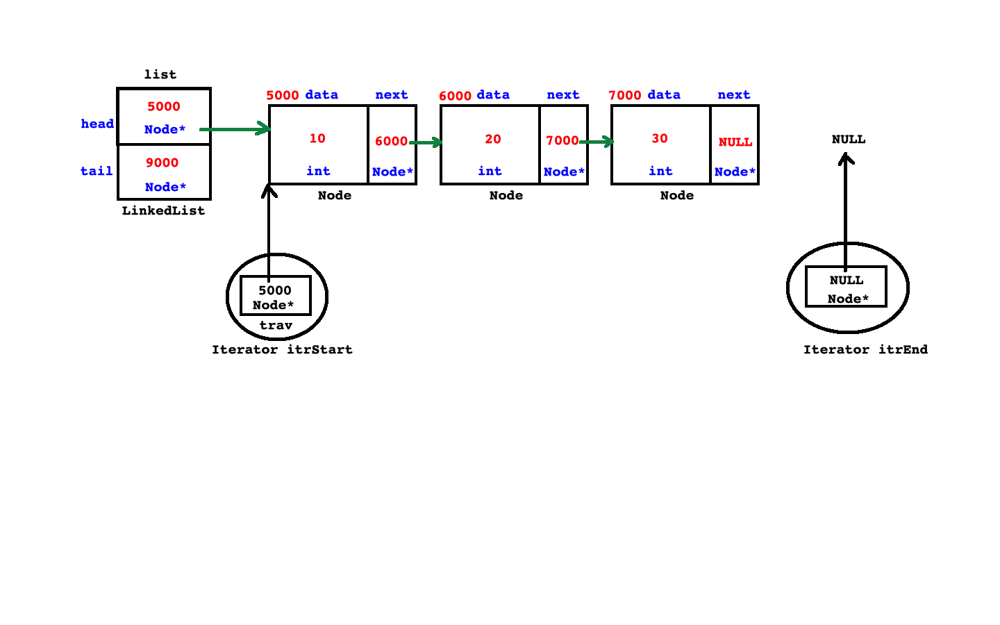
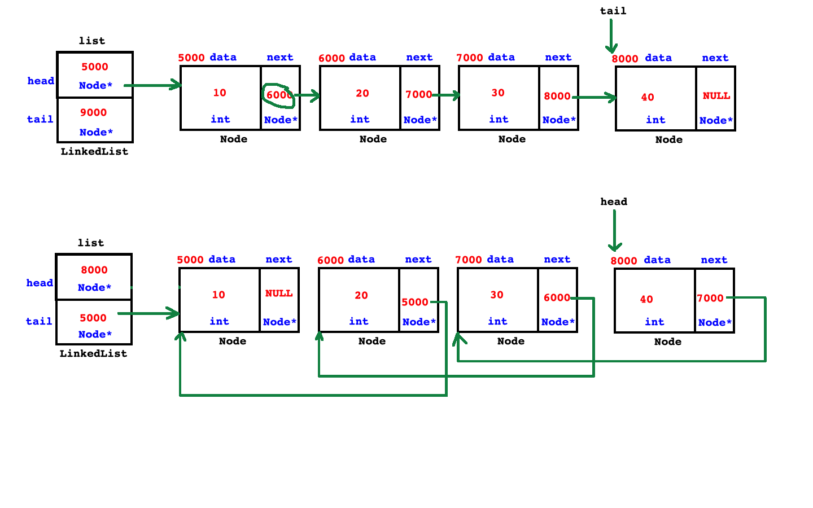
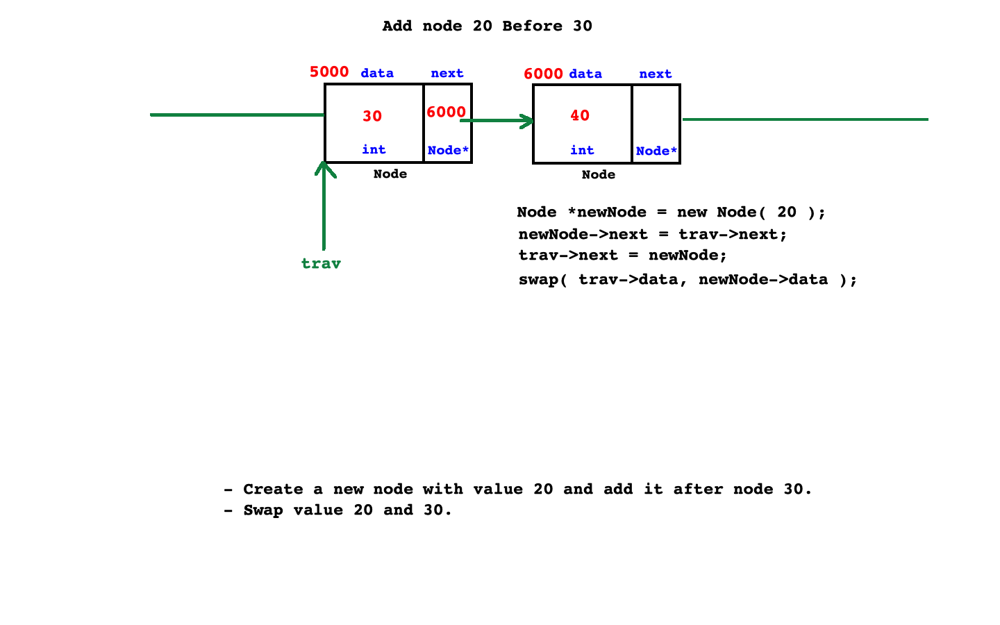
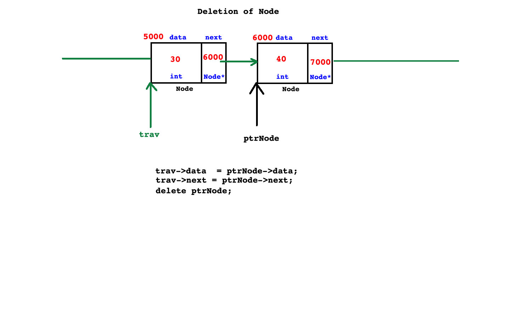

 ### MCQ
 0. * trick to remember precedence table : 
 + PUMA S REBL TACO 

 1.  find duplicate element of array
 2. find maximum element of array

3. which sort doesnt use divide and conquer
+ linear doesnt use Divide and Conquer,
+ rest uses -->binary,quick,merge
## Interview Question 
3. How to traverse Linked List in outside of class or non member function ?
* create iterator class

```cpp
#include<iostream>
#include<string>
using namespace std;

namespace collection
{
	class Exception
	{
	private:
		string message;
	public:
		Exception( string message = " " ) throw( ) : message( message )
		{	}
		string getMessage( void )const throw( )
		{
			return this->message;
		}
	};
	class Iterator;		//Forward declration
	class LinkedList;	//Forward declration
	class Node
	{
	private:
		int data;
		Node *next;
	public:
		Node( int data = 0 ) throw( ) : data( data ), next( NULL )
		{	}
		friend class Iterator;
		friend class LinkedList;
	};
	
   class Iterator{
   
   private: 
    Node *trav; 

  	public: 
	  Iterator(Node *trav)
	  { 
		  this->trav = trav; 
          
	  }   

	  bool operator!=(Iterator &other)
	  {
		return  this->trav != other.trav; 
	  }

	  void operator++(void)
	  {
		  this->trav = this->trav->next; 
	  }

	  int operator*(void)
	  {
		  return this->trav->data; 
	  }

   };

	class LinkedList
	{
	private:
		Node *head;
		Node *tail;
	public:
		LinkedList( void )throw( ) : head( NULL ), tail( NULL )
		{	}
		bool empty( void )const throw( )
		{
			return this->head == NULL;
		}
		void addLast( int data )throw( bad_alloc )
		{
			Node *newNode  = new Node( data );
			if( this->empty( ) )
				this->head = newNode;
			else
				this->tail->next = newNode;
			this->tail = newNode;
		}
		void removeFirst( void )throw( Exception )
		{
			if( this->empty( ) )
				throw Exception( "LinkedList is empty" );
			else if( this->head == this->tail )
			{
				delete this->head;
				this->head = this->tail = NULL;
			}
			else
			{
				Node *ptrNode = this->head;
				//this->head = ptrNode->next;	//or
				this->head = this->head->next;
				delete ptrNode;
			}
		}

		Iterator begin(void)
		{
            Iterator itr(this->head);

			return itr;  
		}
		Iterator end(void)
		{
			Iterator itr(NULL);

           return itr; 
		}
		
	};
}
int main( void )
{
    // iterate list in non member function 
  using namespace collection; 
  LinkedList list; 
  list.addLast(10); 
  list.addLast(20);
  list.addLast(30);  
    
 Iterator itrStart	= list.begin();
	Iterator itrEnd = list.end();

	while(itrStart != itrEnd) // itrStart.operator!= (itrEnd) 
	{
        cout<< ( *itrStart ) <<endl; // itrStart.operator*() 
		++ itrStart; //itrStart.operator++()
	} 

	cout<<endl; 
	return 0;
}

```

4. How to reverse a linked list? 
* using recursion 
* using 3  pointers
 

```cpp
 void reverse(void) throw(Exception)
        {
            if(this->empty())
            throw Exception("LinkedList is empty");
           
           Node *trav = this->head; 

           Node* current;
           Node* previous = NULL;  
           while(trav != NULL)
           {  current = trav; 
               trav = trav->next; 
                current->next = previous; 
                 previous = current; 
            
           }

           this->tail = this->head; 
           this->head = previous; 

        }

```

5. Add node before


6.  Delete,node whose address is given, with a node after it  


7. How to create Heterogeneous Linked List 
* upcasting , dynamic cast, inheritence 

8.  Application of stack 
+  For parenthesis balancing .  
+ to implement undo and redo function 

9. Evaluate infix to  prefix and postfix, so number of time push and pop takes place

10. integer conversion to binery equivalent
11. how to balance parantesis
 * 1. String of parenthesis is given for example “((())) “ or ({}) etc. and we need to find out if they are balanced. Means, if there are matching pairs or not.
 * 2. for example, ({}) is balanced parentheses and ((((()) is not a balanced parenthesis.
 * 3. Algorithm:
  + 1. Traverse the expression string
  + 2. If the current character is a opening bracket or parenthesis e.g. ‘(‘ or ‘{‘ or ‘[‘  then push in the stack.
  + 3. If the current character is a closing bracket e.g ‘)’ or ‘}’ or ‘]’ then  pop a character from  the stack and check if it is a corresponding parenthesis, if matched then pop it from stack.
  + 4. Once, string traversal is complete then check if stack is empty or not. If the stack is empty parenthesis are balanced.
 
* 4. Time Complexity: O(n) – traverse string of n length.
* 5. Space complexity O(n) – Due to Stack

 12.  string reverse logic 

 ```cpp
 void strrev(char str[])
{
    int frontIndex = 0;
    int backIndex = strlen(str) - 1; 

while(frontIndex < backIndex)
    swap(str[frontIndex++],str[backIndex--]);
}

 ```

13. program from decimal to binary 

```cpp
#include<iostream>
using namespace std; 
int main ()
{
    int num, bin;
    cout << "Enter the number : ";
    cin >> num;
    cout << "The binary equivalent of " << num << " is ";
    while (num > 0)
    {
        bin = num % 2;
        cout << bin;
        num /= 2;
    }
    return 0;
}
```

14. DS intrview, write non recersice preorder,postorder,inorder 


